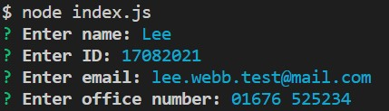

# Team-Profile-Generator

# Module 12 Challenge - Team Profile Generator

## Description

I was tasked with creating a quick Team Profile Generator by utilising Classes, Subclasses and other advanced JavaScript concepts.

In a similar vein as the Readme Generator I had to create an application which created an output, in this case to HTML.

This is a Node.js command-line application. The application takes in information about employees on a software engineering team, then generates the HTML webpage that displays summaries for each person.

The user's key information will be available at a glance, and is harvested by using Inquirer prompting. The unit testing is handled by Jest and has been added to the package.json file.

## Installation
This application runs in your CLI. Open index.js in your integrated terminal and run

```
node index.js
```

## Usage

The Challenge is comprised of several files and folders, which seems to be typical for Node. In order for Jest to run correctly a specific test folder was needed. 

The program is executed by running the following code in the terminal:

```
node index.js
```

When this is executed, it will prompt you for common attributes - a Name, ID and Email. The first run will always ask for the Manager's details (although this isn't strictly obvious right now) and therefore it will ask for the Office Number



Once a Manager has been added you can start adding Engineers or Interns. This will be prompted as a list so you can choose yourself. If you choose Engineer you will get the usual common questions however it will ask for a GitHub username:


And finally when adding an Intern you will be asked for the name of the school they are attending:


Then to round it off you may conclude by selecting "Finish building my team" from the menu, once selected it will take all the information you fed it earlier into your Team profile page called team.html:


Here is an example of how a finished page looks:


Testing completed successfully for this latest version:


## Credits

Usual credits to the teaching staff and support we've recieved over the course of this intensive bootcamp.

The University of Birmingham provided the materials and guides I used to get this started: https://www.birmingham.ac.uk/index.aspx

To the incredible people who contribute to Stack Overflow: https://stackoverflow.com/

The creators of the MDN: https://developer.mozilla.org/en-US/

W3 Schools: https://www.w3schools.com/

License
There is no license specified for this project.